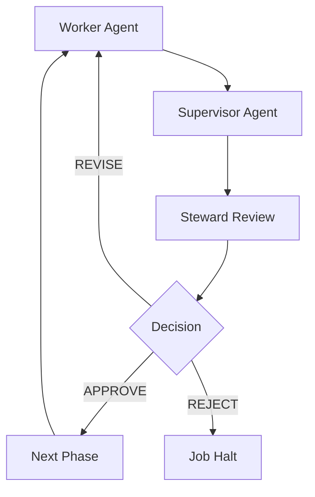
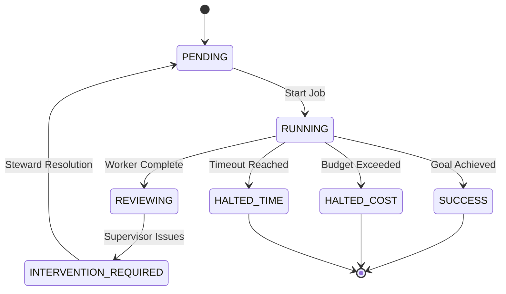

# Logist Overview

[](https://github.com/your-repo/logist)
[](https://www.python.org/downloads/)
[](https://opensource.org/licenses/MIT)

## 🎯 What is Logist?

**Logist** is a sophisticated agent orchestration tool that brings maritime-inspired discipline to AI agent workflows. Just as a ship's logist manages resources and coordinates complex operations, Logist provides structured supervision and resource management for persistent, multi-step AI agent jobs.

At its core, Logist transforms chaotic AI agent interactions into safe, predictable, and human-supervised processes. It uses a pluggable **Agent Provider** architecture to execute AI coding agents (such as Cline, Aider, Claude Code, and others) through carefully orchestrated workflows, combined with **Runners** that manage execution environments (Podman, Docker, Kubernetes, or direct host execution).

## 🌟 Key Value Proposition

- **🛡️ Safety First**: Complete Git isolation prevents workspace corruption
- **🎯 Human Control**: Strategic checkpoints maintain oversight throughout execution
- **📊 Resource Aware**: Cost and time thresholds prevent runaway AI expenses
- **🔄 State Persistence**: Jobs survive interruptions with complete rollback capability
- **🏗️ Structured Workflows**: Three-phase execution loop ensures quality and reliability

## 🚀 Why Logist Matters

### The Problem with Ad-Hoc Agent Workflows

Traditional approaches to running AI agents often suffer from:

- **High Risk**: Agents can make unintended changes to your workspace
- **Poor Visibility**: Limited insight into what agents are doing or why
- **No Cost Control**: AI API costs can spiral out of control
- **Lost Progress**: Jobs cannot survive interruptions or failures
- **Quality Concerns**: No systematic review or quality assurance process

### Logist's Solution

Logist addresses these challenges through an architecture inspired by maritime operations:

- **Isolated Execution**: Each job runs in a dedicated Git branch with rollback capability
- **Three-Phase Quality Loop**: Worker → Supervisor → Steward ensures quality control
- **Resource Guardrails**: Automatic halting when cost/time thresholds are exceeded
- **Complete State Tracking**: Jobs persist across sessions and survive failures
- **Human Gatekeepers**: Strategic interventions prevent automated overreach

## 🏗️ Core Architecture

### Three-Phase Execution Loop



1. **Worker Agent**: Executes actual implementation work
2. **Supervisor Agent**: Reviews quality and identifies issues
3. **Steward (Human)**: Makes strategic decisions and provides guidance

### State Machine Overview

Logist manages jobs through 8 well-defined states:



### Safety Architecture

- **Git Isolation**: Every job begins with a baseline commit and runs in an isolated branch
- **Complete Rollback**: Failed jobs can be completely reset while preserving history
- **Resource Enforcement**: Jobs halt automatically when hitting budget or time limits
- **Human Checkpoints**: Complex decisions require Steward approval

## 📋 Key Features

### Job Management
- **Persistent Jobs**: Multi-step workflows that survive interruptions
- **State Tracking**: Complete history of all agent interactions and decisions
- **Resource Monitoring**: Real-time tracking of costs, time, and action counts
- **Flexible Configuration**: Role-based agents with customizable behaviors

### Agent Roles System
- **Worker**: Implementation specialist focused on executing complex tasks
- **Supervisor**: Quality assurance agent that reviews and validates work
- **Custom Roles**: Extensible system for domain-specific agent behaviors

### Communication Protocol
- **Structured JSON**: All agents communicate via validated JSON schemas
- **Three Actions**: `COMPLETED`, `STUCK`, or `RETRY` determine flow control
- **Evidence Tracking**: All modified files and artifacts are systematically recorded
- **Summary Reports**: Each phase generates context for the next agent

## 🔧 Technical Highlights

### Git Integration
```bash
# Every job starts with isolation
git checkout -b job-{job_id}-{timestamp}  # Create isolated branch
git reset --hard {baseline-hash}         # Start from clean baseline
# Agent work occurs here...
git add . && git commit -m "Agent: {phase}"  # Commit changes
```

### Resource Management
```python
job_spec = {
    "cost_threshold": 10.00,        # Max $10.00 spend
    "time_threshold_minutes": 60,   # Max 1 hour execution
    "max_iterations": 50            # Prevent infinite loops
}
```

### Role Configuration
```json
{
  "roles": {
    "Worker": {
      "name": "Worker",
      "description": "Expert software development and implementation agent",
      "instructions": "You are an expert software engineer...",
      "llm_model": "grok-code-fast-1"
    }
  }
}
```

## 📊 Current Development Status

### Implementation Phases

Logist follows a systematic, phase-based development approach:

#### ✅ **Phase 0: Foundation** (Completed)
- JSON schema validation infrastructure
- Basic CLI command structure
- Role and job configuration schemas

#### 🏗️ **Phase 1: Directory & Config Management** (In Progress)
- Job directory initialization (`logist init`)
- Job listing and selection (`logist job list`, `job select`)
- Job creation framework (`logist job create`)

#### 📅 **Phase 2-7: Execution Engine**
- Job execution commands (`run`, `step`, `poststep`)
- Agent role execution system
- Resource tracking and threshold enforcement
- State persistence and recovery

### Core Technologies
- **Language**: Python 3.8+ with modern packaging
- **CLI Framework**: Click for command-line interface
- **Agent Execution**: Pluggable agent providers (Cline, Aider, Claude Code, etc.)
- **Runner Environments**: Pluggable runners (Podman, Docker, Kubernetes, direct)
- **State Management**: JSON-based job manifests and history tracking
- **Schema Validation**: JSON Schema for structured communication
- **Git Safety**: Branch isolation and commit management

## 🚦 Quick Start Guide

### 1. Prerequisites
```bash
# Install an AI coding agent CLI (e.g., Cline, Aider, or Claude Code)
# Example with Cline:
npm install -g @cline/cli
cline config set openai.key sk-your-key-here

# Example with Aider:
pip install aider-chat

# Example with Claude Code:
# See https://claude.ai/claude-code for installation
```

### 2. Install Logist
```bash
# Create virtual environment
python3 -m venv venv
source venv/bin/activate  # Linux/macOS

# Install from source
git clone <repository-url>
cd logist
pip install -e .
```

### 3. Initialize Jobs Directory
```bash
# Create managed jobs area
logist init
logist job list  # Should show empty
```

### 4. Create and Run Your First Job
```bash
# Create sample job
logist job create config/sample-job.json

# Execute job with full supervision
logist job run sample-job

# Monitor progress
logist job status sample-job
```

## 🎯 Target Use Cases

### Software Development Workflows
- **Complex Refactoring**: Multi-step code transformations requiring careful review
- **New Feature Implementation**: Structured development with quality gates
- **Bug Investigation**: Systematic debugging across multiple files and components

### Research and Analysis
- **Data Processing Pipelines**: Safe execution of multi-stage data analysis
- **Document Synthesis**: Coordinated creation of comprehensive documentation
- **Experimentation Frameworks**: Structured testing of multiple AI approaches

### Quality-Assured Automation
- **Production Deployments**: Human-verified changes before release
- **Configuration Management**: Validated infrastructure and system changes
- **Content Creation**: Review-gated publishing workflows

## 🔮 Future Vision

### Near-Term Roadmap (Phase 8+)
- **Batch Execution**: Running multiple jobs with resource pooling
- **Advanced Metrics**: Detailed performance analytics and cost optimization
- **Enhanced Git Integration**: Seamless merging of agent-generated changes
- **Enterprise Features**: Role-based access control and audit logging

### Long-Term Goals
- **Multi-Agent Coordination**: Complex agent interactions and delegation
- **Domain Specialization**: Pre-built role libraries for specific industries
- **Deployment Automation**: Docker containerization and orchestration
- **API Integration**: REST APIs for job management and monitoring
- **Visual Interface**: Web-based dashboard for job supervision

## 🤝 Getting Involved

### For Users
Start with the [Installation Guide](../README.md#installation) and work through the [CLI Reference](cli-reference.md) to understand command patterns.

### For Contributors
See the [Project TODO](todo.md) for systematic implementation guidance and [Contributing Guide](../README.md#contributing) for development setup.

### For Stakeholders
Review the [Architecture Deep Dive](architecture.md) and [Role System Details](roles-overview.md) to understand the technical foundations.

## 📚 Documentation Map

### 🤖 **For AI Agents: Reading Priority Guide**

**New AI agents joining the project:**
1. Read `overview.md` (this file) first - get 30-second project comprehension
2. Read `architecture.md` - understand core concepts, jobs, agents, safety
3. Read `roles-overview.md` - understand Worker/Supervisor role specialization
4. Skim `cli-and-metrics.md` - know how humans interact with the system
5. Read specific docs only when needed for your assigned task

**For executing jobs:**
- Focus on `technical/communication-protocol.md` for understanding JSON response requirements
- Use `state-machine.md` only if implementing state transition logic
- Reference `archive/research-notes.md` only for historical Cline integration patterns

**For developing new features:**
- Read `implementation-history.md` for current architecture status and decisions
- Study technical details in `technical/` directory
- Review `testing-strategy.md` for testing approaches

**For security/cost analysis:**
- Focus on sections about Git isolation and resource guardrails
- Study evidence file tracking and **[Logging, Monitoring & Debugging](technical/logging-monitoring.md)**

---

### 📖 **For Humans: Reading Guide**

#### **User Onboarding (Start Here)**
- **[Executive Overview](overview.md)** ← You are here - Project introduction
- **[Quick Start](../README.md#quick-start)** - Installation and first job
- **[Architecture Overview](architecture.md)** - Core concepts explained

#### **Job Execution**
- **[Role System](roles-overview.md)** - Worker & Supervisor agent specialization
- **[CLI Commands](cli-and-metrics.md)** - Complete command reference
- **[State Machine Logic](state-machine.md)** - Workflow and transitions

#### **Technical Implementation**
- **[Communication Protocol](technical/communication-protocol.md)** - JSON schemas & agent responses
- **[Logging, Monitoring & Debugging](technical/logging-monitoring.md)** - Log files, metrics & debugging
- **[Implementation History](implementation-history.md)** - Development timeline
- **[Testing Strategy](testing-strategy.md)** - QA and validation

#### **Historical Archive**
- **[Research Notes](archive/research-notes.md)** - Cline integration findings
- **[Implementation Prompts](archive/implementation-prompts/)** - Development artifacts

---

**Logist brings maritime discipline to AI agent workflows - structured, safe, and human-supervised orchestration for the AI-native development era.**

[](https://github.com/your-repo/logist)
[](docs/)
[](../LICENSE)