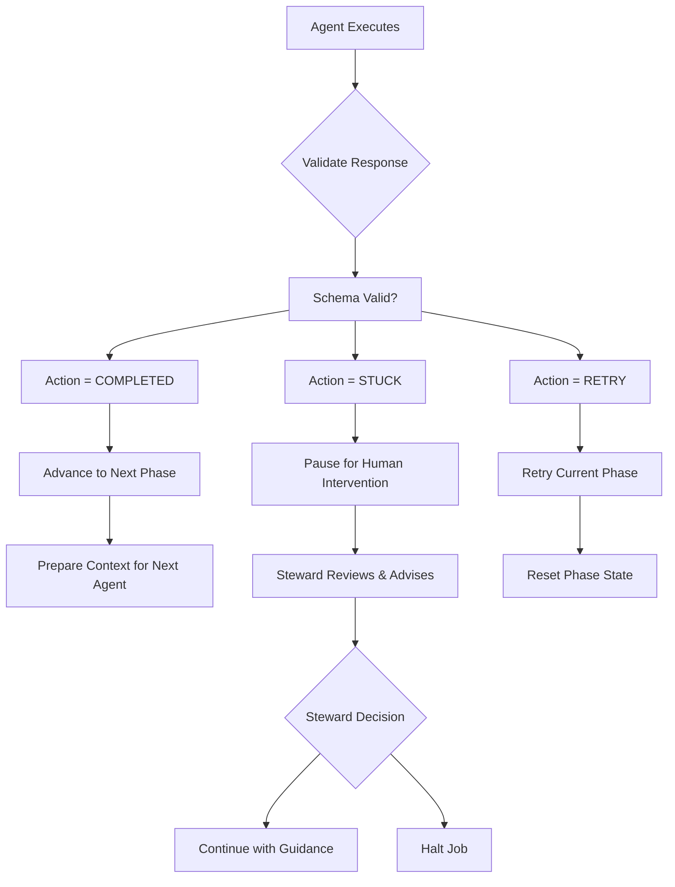

# Communication Protocol & Data Structures

## JSON Schema Specifications

### Agent Response Schema (`schemas/llm-chat-schema.json`)

```json
{
  "$schema": "http://json-schema.org/draft-07/schema#",
  "title": "Agent Response Schema",
  "description": "Structured response format for all agent interactions",
  "type": "object",
  "required": ["action", "evidence_files", "summary_for_supervisor"],
  "properties": {
    "action": {
      "type": "string",
      "enum": ["COMPLETED", "STUCK", "RETRY"],
      "description": "Workflow control signal determining next Logist action"
    },
    "evidence_files": {
      "type": "array",
      "items": {
        "type": "string",
        "description": "Relative path from job workspace root"
      },
      "description": "Files created, modified, or analyzed during execution",
      "minItems": 0
    },
    "summary_for_supervisor": {
      "type": "string",
      "description": "Concise status update for subsequent agents (2-3 sentences)",
      "maxLength": 500
    }
  }
}
```

### Job Manifest Schema

```json
{
  "$schema": "http://json-schema.org/draft-07/schema#",
  "title": "Job Manifest Schema",
  "description": "Complete job state and configuration specification",
  "type": "object",
  "required": ["job_id", "status", "metrics"],
  "properties": {
    "job_id": {
      "type": "string",
      "description": "Unique job identifier"
    },
    "description": {
      "type": "string",
      "description": "Human-readable job purpose"
    },
    "status": {
      "type": "string",
      "enum": ["DRAFT", "PENDING", "RUNNING", "REVIEWING", "SUCCESS", "CANCELED", "INTERVENTION_REQUIRED", "HALTED_COST", "HALTED_TIME"],
      "description": "Current job execution state"
    },
    "current_phase": {
      "type": ["string", "null"],
      "description": "Active workflow phase identifier"
    },
    "metrics": {
      "type": "object",
      "properties": {
        "cumulative_cost": {
          "type": "number",
          "description": "Total USD cost in cents",
          "minimum": 0
        },
        "cumulative_time_seconds": {
          "type": "number",
          "description": "Total execution time in seconds",
          "minimum": 0
        }
      }
    },
    "history": {
      "type": "array",
      "items": {
        "type": "object",
        "properties": {
          "timestamp": {"type": "string", "format": "date-time"},
          "role": {"type": "string"},
          "action": {"type": "string"},
          "evidence_files": {"type": "array", "items": {"type": "string"}}
        }
      },
      "description": "Complete audit trail of job interactions"
    }
  }
}
```

## Agent Communication Flow

### Request Structure
Logist initiates all agent interactions with a structured request object:

```json
{
  "job_id": "unique-job-identifier",
  "phase": "current-workflow-phase",
  "context_files": ["evidence1.txt", "spec.md", "context.json"],
  "system_prompt": "Role-specific instruction set...",
  "task_description": "Specific work assignment for this phase",
  "metadata": {
    "cost_threshold": 1000,
    "time_threshold_minutes": 60,
    "accepted_formats": ["COMPLETED", "STUCK", "RETRY"]
  }
}
```

### Response Validation
All agent responses undergo multi-layer validation:

1. **JSON Schema Compliance** - Structure validation against `llm-chat-schema.json`
2. **Action Enumeration** - Exactly one of: `COMPLETED`, `STUCK`, `RETRY`
3. **Evidence File Resolution** - All paths exist in workspace directory
4. **Summary Constraints** - Length and content appropriateness

### Error Handling Protocols
Invalid responses trigger automatic fallback behaviors:

- **Schema Violation** → `STUCK` status, human intervention required
- **File Path Invalid** → Warning logged, but response accepted
- **Action Invalid** → `STUCK` status with descriptive error message
- **Summary Missing** → `STUCK` status, detailed review requested

## Job History Architecture

### Storage Format (`jobHistory.json`)

```json
{
  "job_id": "example-job-001",
  "created_at": "2025-01-29T10:00:00Z",
  "interactions": [
    {
      "sequence": 1,
      "timestamp": "2025-01-29T14:30:45Z",
      "state_before": "PENDING",
      "workspace_path": "/jobs/example-job-001/workspace",
      "request": {
        "prompt": "Complete prompt text sent to LLM...",
        "files_context": ["evidence1.md", "config.json", "source.py"],
        "metadata": {
          "role": "Worker",
          "phase": "PENDING",
          "model": "grok-code-fast-1",
          "temperature": 0.7,
          "max_tokens": 4096
        }
      },
      "response": {
        "status": "SUCCESS",
        "action": "COMPLETED",
        "evidence_files": ["results.py", "tests/test_results.py"],
        "summary_for_supervisor": "Successfully implemented feature X with test coverage",
        "raw_response": "{\"action\": \"COMPLETED\", \"evidence_files\": [...], \"summary_for_supervisor\": \"...\"}",
        "execution_time_seconds": 45.23,
        "cost_usd": 0.0034
      }
    }
  ],
  "recovery_points": [
    {
      "checkpoint_id": "phase-1-complete",
      "sequence": 1,
      "can_resume_from": true,
      "description": "Worker completed initial implementation"
    }
  ]
}
```

### History Field Specifications

#### Core Tracking Fields
- **`sequence`**: Zero-based interaction counter for chronological ordering
- **`timestamp`**: ISO 8601 timestamp for precise temporal tracking
- **`state_before`**: Job state prior to this interaction (for debugging)

#### Request Documentation
- **`request.prompt`**: Exact prompt text sent to LLM (for reproducibility)
- **`request.files_context`**: Files included in LLM context array
- **`request.metadata`**: Execution parameters (model, temperature, etc.)

#### Response Documentation
- **`response.status`**: Execution outcome (SUCCESS, ERROR, TIMEOUT)
- **`response.action`**: Agent's workflow control decision
- **`response.evidence_files`**: Artifacts produced during execution
- **`response.raw_response`**: Original JSON string for validation
- **`response.execution_time_seconds`**: Precise timing measurement
- **`response.cost_usd`**: Exact API cost incurred

### Recovery Checkpoint System
JobHistory enables precise state restoration through recovery checkpoints:

```json
{
  "recovery_points": [
    {
      "id": "phase-implementation-complete",
      "sequence": 3,
      "resume_phase": "supervisor-review",
      "rollback_files": ["implemenation.py", "tests/"],
      "metadata": {
        "confidence": "high",
        "evidence_count": 5,
        "test_pass_rate": "100%"
      }
    }
  ]
}
```

## Flow Control Logic

### State Machine Transitions



### Error Escalation Matrix

| Error Type | Response Action | Escalation Level | Recovery Mechanism |
|------------|----------------|------------------|-------------------|
| Schema Invalid | STUCK | Human Required | Steward reviews LLM output |
| Files Missing | Warning + Accept | Automatic | Log warning, continue execution |
| Action Malformed | STUCK | Human Required | Steward clarifies intent |
| Timeout Exceeded | STUCK | Human Required | Steward assesses if job should continue |
| API Error | RETRY | Automatic (up to 3x) | Exponential backoff retry |

### Agent Output Requirements
All agents must adhere to strict output protocols:

1. **Single JSON Object**: Exactly one well-formed JSON response
2. **No Extraneous Text**: No comments, markdown, or human-readable explanations
3. **Workspace Focus**: All file references are relative to job workspace
4. **Evidence Completeness**: Include all created/modified files in evidence_files array
5. **Summary Conciseness**: 2-3 sentences maximum for supervisor context
6. **Action Determinism**: Choose exactly one action, based on clear completion criteria

## Testing Infrastructure

### Response Validation Testing

```python
def validate_agent_response(response_json: str) -> bool:
    """Validate agent response against protocol requirements."""
    try:
        data = json.loads(response_json)
        schema.validate(data)

        # Additional business logic validation
        assert data['action'] in ['COMPLETED', 'STUCK', 'RETRY']
        assert isinstance(data['evidence_files'], list)
        assert len(data['summary_for_supervisor']) <= 500

        # File existence validation
        for file_path in data['evidence_files']:
            assert os.path.exists(os.path.join(workspace_dir, file_path))

        return True
    except (json.JSONDecodeError, ValidationError, AssertionError):
        return False
```

### History Replay Testing
```python
def replay_job_history(job_dir: str, until_sequence: int = None):
    """Replay job interactions for testing state consistency."""
    history = load_job_history(job_dir)

    for interaction in history['interactions'][:until_sequence]:
        # Validate response format
        assert validate_agent_response(interaction['response']['raw_response'])

        # Verify state transitions
        expected_state = calculate_next_state(interaction['state_before'],
                                            interaction['response']['action'])
        assert expected_state == interaction['response'].get('new_status')
```

## Performance & Reliability Considerations

### Schema Evolution
- Version field in all schema documents for forward compatibility
- Migration paths for breaking schema changes
- Backward compatibility windows for agent updates

### Scalability Constraints
- History file size limits (rotation after 100MB)
- Compression for long-running job archives
- Indexing strategies for large interaction histories

### Privacy & Security
- Prompt content encryption for sensitive jobs
- Response sanitization before history storage
- Audit logging for all protocol violations